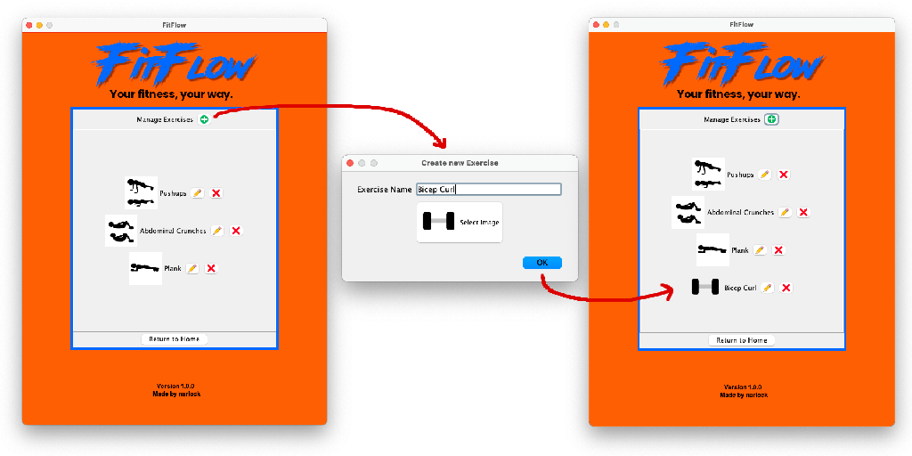
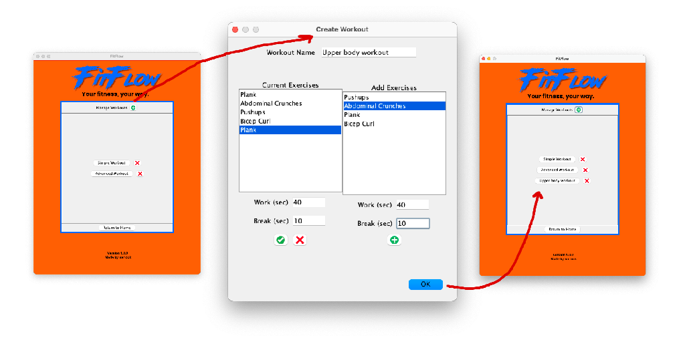
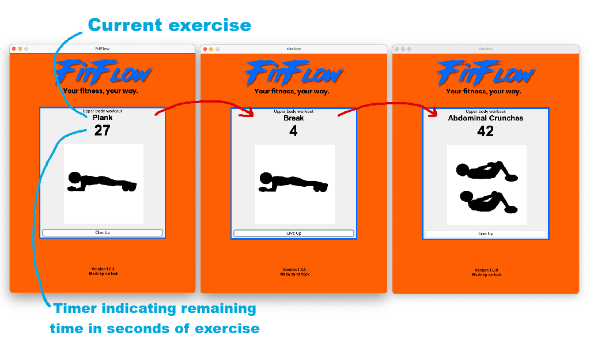
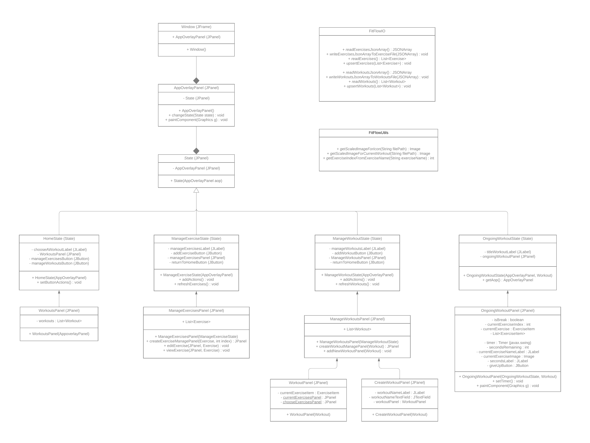

 
by narlock

Create custom workouts, track progress, and stay motivated with streaks and a workout calendar. Your fitness, your way.

## Version 1.0.0

### Manage exercises
Create, read, update, and delete exercises. Each exercise contains a title alongside a custom image that can be selected by the user.

 

- Pressing the `+` button at the top will allow the user to create a new exercise. An exercise has a given name and an optional image to distinguish exercises.
    - You can click "Select Image" to search for an image on your computer to add for the exercise. (Supported file types are: `.png`, `.jpg`, and `.jpeg`)
- User can modify exercises by selecting the pencil icon.
- User can delete exercises by pressing the `x` icon.

### Manage workouts
A workout is a set of exercises where each exercise has a `workTime` and `breakTime`, indicating the amount of seconds that the exercise will be performed and how long of a break in seconds the user will take after performing the workout. The user can create, read, update, and delete workouts.

 

- Pressing the `+` button at the top will allow the user to create a new workout.
    - When creating a workout, the user will have a selection of exercises to add. These selections will be the list of exercises that they can manage in manage exercises. Here, they can click on the exercise they want to add and assign it a work time and break time. Once completed, selecting the `+` will add it to the current exercises list.
    - Current exercises will appear on the left hand side of the screen. These can also be modified by selecting on them and saved by pressing the check button. To remove a current exercise, click it and then hit the `x` button.
- Selecting a workout (left hand side) will allow the user to edit the workout. The interface is similar to creating a workout.
- Once a workout has been created, the user will see it once they have clicked the OK button.
- Workouts can be deleted by pressing the `x` icon next to the associated exercise.

### Perform workout
On the home screen, the user will see their list of workouts that they have created. They can select a workout and perform it. Upon performing the workout, the workout will count down the number of seconds associated to each exercise in the workout. Once the workout is complete, the user will be notified that the workout is complete.

 

### High-level UML Design

 

## Future Development
- Calendar for workout streak tracking: tracking the amount of time you spent working out on a specific day
- Adding encouraging and motivating messages during ongoing workouts.'
- Expanding the FitFlow application to provide calorie tracking and additional goal setting.
    - Providing a BMI calculator
    - Providing a calorie input system and goal system
